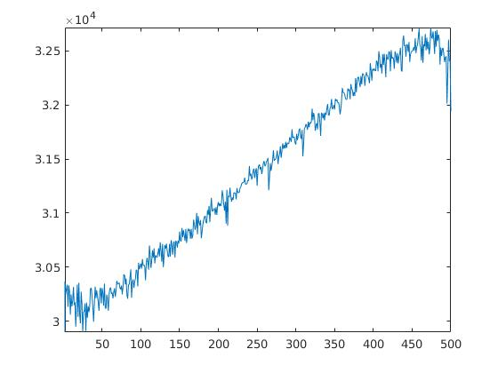
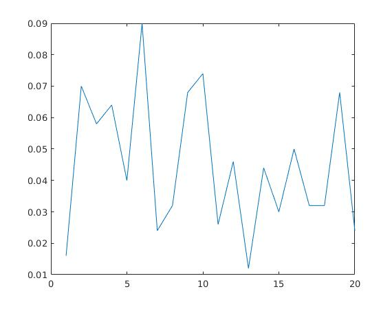
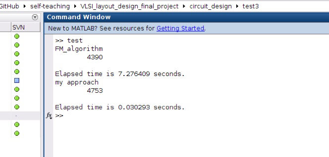

# 问题陈述

随着电路规模的不断增张，单个芯片大小已经不足以承载所需要的功能，在层次化设计中，会产生芯片间的互联线，这些互联线的布局成本相比于片上成本要高很多，为了在电路分割的过程中最大限度的降低片间连线的数目，需要采用优秀的分割算法。


# Fiduccia-Mattheyses Algorithm

KL算法在限定分割结果等大小的基础之上，通过$cell-gain$排序，进行双向交换来寻找最优分割，FM算法则在此基础上，进行优化：

* 将双向交换变为移动单个节点，通过提前规定两区块的大小能够从等量分割偏移程度，为最终图分割结果提供了更大的灵活性，同时有保证分割结果不会违反分配平衡。当要进行分割的图有$n$个节点，每两节点之间有边的概率为$f$，那么当最终的分割结果其中一个区块为$alpha n$时，被切割的边数为$f alpha (1-alpha) n^{2}$，对比当其中一个区块为1时，被分割的边数为$f(n-1)$，可以知道，从根本上，当分割所得两区块的节点数目相差甚大时，被切割的边数就会下降，然而这样的分割结果并不能够满足我们要求，因此设定一个偏差比例，既可以保证分割结果不偏离均等分割太多，又为分割一定程度上提供了更大的自由度。

* 在KL算法和FM算法中都用到了，对于已经移动过的边进行锁定的方法，是为了防止节点移动过程进入一个循环的过程，这样在一个pass中获得类似于贪婪算法得到的局部最优，在下一个pass中重新以这个局部最优为初始分割时，所有的节点又都回到了自由的状态，多次pass后，得到的最优解在局部和全局最优之间达到一个平衡，并通过生成多个随机初始分割，来防止陷入局部最优。这样的锁定，在很大程度上除了防止节点移动过程在一个pass中进入循环，还能够降低一个pass中每一次$cell-gain$的排序工作量，锁定可以使排序的复杂度随着自由节点的数目减少而降低。

* FM算法为了降低由于排序带来的庞大的计算量，采用了桶状的数据结构，并用一个指针p去指着$cell-gain$最大的链表，由于$cell-gain$的值大部分是集中在0左右的，所以指针p的更新过程计算量虽然理论上为$O(n)$，但实际上为一个常数，即$O(1)$，而更新$cell-gain$的计算量$O(P)$变成主要计算消耗。这样的数据结构可以大幅度降低计算复杂度，但也因为桶状结构的特殊性，其算法的实现平台必须要能够很好的实现链表这一数据结构。

# 用谱方法进行图分割

假设$G$是一个加权的无向图，具体表示方式为$G=(V,E,w)$，其中$V=\{1,2,3,...,n\}$对应图$G$中的顶点的集合，$n$对应图$G$的定点数，$E=\{e1,e2,e3,...,em\}$为图$G$中边的集合，$m$为图$G$中边的条数，而$w$则是一个为每条边赋一个正权值的函数，那么对应图$G$的拉普拉斯矩阵$L$的元素值为：
$$
\begin{equation}
L(p,q)=
\left \{
\begin{array}{lll}
-w(p,q) & (p,q) \in E\\
\sum_{(p,q) \in E} w(p,q) & (p=q)\\
0 & otherwise
\end{array}
\right.
\end{equation}
$$
也就是说，当边$(p,q) \in E$时，$L(p,q)$对应边权值的负数形式，当$p=q$时，对应的即为定点$p$，在矩阵中对应$L(p,q)$元素的值为与顶点$p$连接的所有边的权值之和，当$(p,q)$既不是图$G$的顶点也不再集合$E$中时，在矩阵$L$中对应的坐标元素为0。
    根据以上拉普拉斯矩阵的定义可知，矩阵$L$为一个半正定对称矩阵，对于任意非零列向量$x$有：
$$
\begin{equation}
x^T L x = \sum_{(p,q) \in E} w(p,q)(x(p)-x(q))^2 \ge 0
\end{equation}
$$
当列向量的元素，用$x(i)=1$代表顶点$i$被分割至$A$区，$x(i)=-1$代表顶点$i$被分割至$B$区:
$$
\begin{equation}
x(i)=
\left \{
\begin{array}{ll}
1 & i \in A\\
-1 & i \in B
\end{array}
\right.
\end{equation}
$$
综上，可知$x^T L x = \sum_{p \in A, q \in B} 4w(p,q) + \sum_{p \in B, q \in A} 4w(p,q)$为被切割的边的4倍。
对于任意列向量$x$可以分解为$x= \sum_{i=1}^{n} \alpha_i u_i$，于是可以推导得：
$$
\begin{equation}
x^T L x=(\sum_{i=1}^{n} \alpha_i u_i)^T L (\sum_{i=1}^{n} \alpha_i u_i)=\sum_{i=1}^{n} \alpha_i^2 u_i^T L u_i$
\end{equation}
$$
而又已知$\sum_{i=1}^{n} \alpha_i^2=n$，对于公式$Lu_i=\lambda_i u_i$两端同时乘上$u_i$，可得$u_i^T L u_i=\lambda_i u_i^T u_i=\lambda_i$，也就是说：
$$
\begin{equation}
\left\{
\begin{array}{ll}
x^T L x=\sum_{i=1}^{n} \alpha_i^2 \lambda_i\\
\sum_{i=1}^{n} \alpha_i^2 = n
\end{array}
\right.
\end{equation}
$$
当$\lambda_i$为0时，图$G$所有的顶点都被分割至一个单独的区域，这和我们的初始目标不相符，于是$x^T L x$最小的时候，$x=u_i$，其中$u_i$是非零最小特征值对应的特征向量。
值得注意的是，$x$的每个元素绝对值都是1，但是$u_i$却没有保证每个元素绝对值都是1，那么$x^T L x$最小的情况，应该是$x$的方向尽可能的接近$u_i$，也就是要求$x*u_i$最大，其中*代表点乘，很容易推断，$x$的元素正负与$u_i$一致的时候$x*u_i$最大,当向量$x$对应的图像分割不能够满足分配平衡要求时，可以将$u_i$绝对值较小的元素相对应的$x$中的元素符号进行变换，来调整分割，使其满足分配平衡。

# 实验设计

## test1

test1实验通过求取随机拉普拉斯矩阵的特征向量$u_i$，并以$u_i$的元素正负为依据构造相应的分割$x$，求出对应的$x^T L x$，以$u_i$对应的特征值的大小排序为横坐标，相对应的$x^T L x$的大小为纵坐标，绘图，来直观地验证：$x$的方向与较小特征值对应的特征向量越相似，图分割中被分割的边数越少。



```matlab
%%% file: test1.m
clear;
num = 500;
L = create_laplacian_matrix(num);
[V,D] = eig(L);
cut_cost = zeros(1,num);
for i = 1:num
    u = sign(V(:,i));
    cut_cost(1,i) = u' * L * u / 4;
end
x = 1:num;
[ymin,d] = min(cut_cost(1,2:num));
ymax = max(cut_cost);
d
plot(x,cut_cost);
axis([2,num,ymin,ymax]);
```

```matlab
%%% file: create_laplacian_matrix.m
function L = create_laplacian_matrix(num)
A = rand(num) > 0.5;
A = A - triu(A);
B = A + A';
L = diag(sum(B)) - B;
```

location_test则采用多个样本，求取其对应的最小切割办法相对应的特征值排序，来进一步验证，切割$x$的方向与较小特征值对应的特征向量越相似，被分割的边数就越小。

```matlab
%%% file: location.m
function d = location(num)
L = create_laplacian_matrix(num);
[V,D] = eig(L);
cut_cost = zeros(1,num);
for i = 1:num
    u = sign(V(:,i));
    cut_cost(1,i) = u' * L * u;
end
[ymin,d] = min(cut_cost(1,2:num));
```

```matlab
%%% file: location_test.m
num = 500;
time = 20;

d = zeros(1,time);
for i = 1:20
    d(1,i) = location(num);
end
x = 1:time;
plot(x,d/num);
```

## test2

test2通过实现谱方法和FM算法，对比相应算法的运行时间以及对应最有分割被分割的边数。



```matlab 
%%% file: test.m
clear;
num = 200;
L = create_laplacian_matrix(num);
percent = 0.2;
num_pass = 5;
num_initial_cut = 5;

tic;
a = FM_algorithm(num,percent,L,num_pass,num_initial_cut);
disp('FM_algorithm');
disp(a);
toc

tic;
a = my_approach(num,percent,L);
disp('my approach');
disp(a);
toc
```
### 谱方法

```matlab
%%% file: my_approach.m
function a = my_approach(num,percent,L)
[V,D] = eig(L);
v = V(:,2); %%%最小非零特征值所对应的特征向量
u = sign(v); %%%相对应的分割
if abs(sum(u)) < percent * num %%%当分割满足分配平衡要求时
    a = u' * L * u / 4; %%%返回所对应的被分割的边数
else
    if sum(u) > 0 %%%当不满足分配平衡要求，且A区顶点个数多余B区时
        size = (sum(u) - percent * num) / 2; %%%挪动size个A区顶点到B区
        [k,p] = sort(relu(v)); %%%取v向量中最小的前size个正元素坐标
        start = num - sum(v > 0);
        for i = 1:size
            u(p(start + i)) = u(p(start + i)) * (-1); %%%对分割中相应顶点取反
        end
        a = u' * L * u / 4;
    else
        size = (- sum(u) - percent * num) / 2; %%%具体与sum(u) > 0情况时相同
        [k,p] = sort(relu(-v));
        start = num - sum(v < 0);
        for i = 1:size
            u(p(start + i)) = u(p(start + i)) * (-1);
        end
        a = u' * L * u / 4;
    end
end
```

### FM_algorithm

FM算法部分的主函数如下:

```matlab
%%% file: FM_algorithm.m
function best_gain = FM_algorithm(num,percent,L,num_pass,num_initial_cut)
best_gain = num * num;
for i = 1:num_initial_cut
    cut = initialize_cut(num, percent);
    [gain,cut] = one_initial_cut(L,cut,num,percent,num_pass);
    if gain < best_gain
		best_gain = gain;
	end
end
```

相关的函数有一下：

* initial_vertex.m 输入图对应的矩阵以及相应的分割，输出$n*3$的vertex矩阵，其中第一列对应每个节点的cell gain，第二列和第三列分别对应与该节点连接的外部和内部节点数目。

* initial_bucket.m 输入vertex矩阵，以及图的节点数目num，输出一个bucket矩阵，和一个用于记录bucket每一行对应元素的长度的length矩阵，其中由于matlab的元素序号是从1开始，因此，cell gain为-num的部分会平移(1 + num)的距离。

* initial_cut.m 根据图的节点数目，以及区块的大小限制percent，随机生成cut矩阵，然后当cut矩阵满足要求则输出，不满足要求就重新生成。 

* process.m 输入初始矩阵L,分割init,vertex,length,bucket,num,percent,以及用来移动的节点k,得到节点k移动之后被更新的vertex，length,bucket矩阵。

* vertex_process.m 求出下一个用来交换的节点，并判断其是否满足平衡条件，若满足则采用process.m进行cell gain更新。

* pass.m 输入L,vertex,length,bucket,num,percent,然后输出一个pass的运行过程中对应被分割边数最少的cut矩阵以及相应被分割的边数。

* one_initial_cut.m 根据输入的num_pass，对于每个初始cut，运行num_pass次pass.m。

* FM_algorithm.m 则根据num_initial_cut，运行num_initial_cut次one_initial_cut.m。



# 实验结果分析

通过以上实验可知:

* test1很好的验证了，以最小非零特征值所对应的特征向量为正负基础的分割方式，可以很大程度上降低被分割的边数。

* test2则进一步展示了，用最小特征值所对应的特征向量为正负基础的分割方式，被分割的边数与用FM算法所产生的边数差不多，但前者的运行时间大大小于后者。

* 但是在编写FM算法相关文件的时候，由于matlab数据结构相对单一，造成bucket数据结构不能够很好的发挥作用，这一定程度上影响了桶结构对于计算速度的提升。my_approach文件的相关函数均采用了matlab的内置函数，而FM_algorithm则大量自行编写，一定程度上，代码简洁度不够也会影响其相应算法运行速度。

* 本实验的局限在于，假定了每条边连接的节点数都只有两个，且参与计算的矩阵节点数只有200个，但对于实际生产过程中，电路的规模可能会达到百万、千万甚至上亿，此时若想要快速有效的得到较小特征值所对应的特征向量，会需要更加行之有效的算法，且找到的算法计算复杂度与FM算法相比可能会更大。

