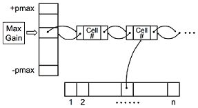
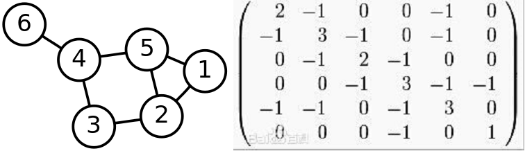
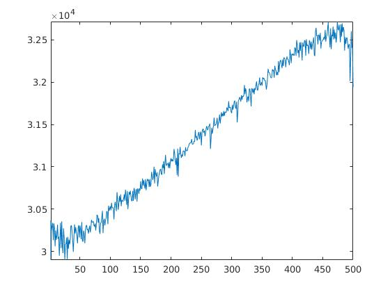
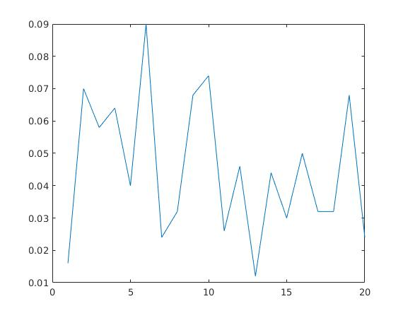
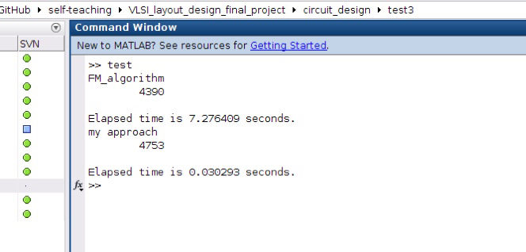

## FM algorithm

FM algorithm在前人基础上的改进:

- 设置cell和net的数据结构，降低查找复杂度
- 采用桶状结构，消除排序造成的运算复杂度
- 继承KL algorithm中cell gain的计算方法，将node节点的移动，从两点交换变成单点移动，提升node节点相互交换的能动性
- 将区块的分配平衡限制，从等量分割变成在一定误差范围内，保持大小基本一致



## my approach

将图转换为拉普拉斯矩阵:
$$
L(p,q)=
\left \{
\begin{array}{lll}
-w(p,q) & (p,q) \in E\\
\sum_{(p,q) \in E} w(p,q) & (p=q)\\
0 & otherwise
\end{array}
\right.
$$



## my approach

$$x^T L x = \sum_{(p,q) \in E} w(p,q)(x(p)-x(q))^2 \ge 0$$
$$
x(i)=
\left \{
\begin{array}{ll}
1 & i \in A\\
-1 & i \in B
\end{array}
\right.
$$
可知:
$$x^T L x = \sum_{p \in A, q \in B} 4w(p,q) + \sum_{p \in B, q \in A} 4w(p,q)$$为被切割边数的4倍。
分解$x$得$x= \sum_{i=1}^{n} \alpha_i u_i$，可以推导得：
$$Lu_i=\lambda_i u_i$$
$$\Rightarrow u_i^T L u_i=\lambda_i u_i^T u_i=\lambda_i$$

## my approach

$$
\left\{
\begin{array}{ll}
x^T L x=\sum_{i=1}^{n} \alpha_i^2 \lambda_i\\
\sum_{i=1}^{n} \alpha_i^2 = n
\end{array}
\right.
$$
当$\lambda_i=0$的时候，被分割的边数为0，也就是说，所有的顶点都被分割至同一边，这和我们的要求不符。
当$x$为非零最小特征值所对应的特征向量时，$x^T L x$的值最小，也就是说被分割的边数最小。
然而，由于$u_i$的元素绝对值不全为1，也就是说$u_i$被直接用作分割向量。要想使$x$与$u_i$的方向最接近，也就是让$x*u_i$尽可能的大，其中*代表点乘:
$$x=sign(u_i)$$

## test1

```matlab
%%% file: test1.m
clear;
num = 500;
percent = 0.4;
L = create_laplacian_matrix(num);
[V,D] = eig(L);
cut_cost = zeros(1,num);
for i = 1:num
    u = sign(V(:,i));
    cut_cost(1,i) = u' * L * u / 4;
end
x = 1:num;
[ymin,d] = min(cut_cost(1,2:num));
ymax = max(cut_cost);
d
plot(x,cut_cost);
axis([2,num,ymin,ymax]);
```

## test1



## location

\begincols

\column{.5\textwidth}

```matlab
%%% file: location.m
function d = location(num)
L = create_laplacian_matrix(num);
[V,D] = eig(L);
cut_cost = zeros(1,num);
for i = 1:num
    u = sign(V(:,i));
    cut_cost(1,i) = u' * L * u;
end
[ymin,d] = min(cut_cost(1,2:num));
```

\column{.5\textwidth}

```matlab
%%% file: location_test.m
num = 500;
time = 20;

d = zeros(1,time);
for i = 1:20
    d(1,i) = location(num);
end
x = 1:time;
plot(x,d/num);
```
\stopcols

## location_test



## my_approach.m

\begincols

\column{.5\textwidth}

```matlab
%%% file: my_approach.m
function a = my_approach(num,percent,L)
[V,D] = eig(L);
v = V(:,2);
u = sign(v);
if abs(sum(u)) < percent * num
    a = u' * L * u / 4;
else
    if sum(u) > 0
        size = sum(u) - percent * num;
        [k,p] = sort(relu(v));
        start = num - sum(v > 0);
        for i = 1:size
            u(p(start + i)) = u(p(start + i)) * (-1);
        end
        a = u' * L * u / 4;
```
\column{.5\textwidth}

```matlab
    else
        size = - sum(u) - percent * num;
        [k,p] = sort(relu(-v));
        start = num - sum(v < 0);
        for i = 1:size
            u(p(start + i)) = u(p(start + i)) * (-1);
        end
        a = u' * L * u / 4;
    end
end
```

\stopcols

## FM_algorithm.m

```matlab
%%% file: FM_algorithm.m
function best_gain = FM_algorithm(L,num,percent,num_pass,num_cut)
[cell,net] = initialize_cell_net(L,num);
best_gain_list = zeros(num_cut,1);
for i = 1:num_cut
	cut = initialize_cut(num,percent);
	for j = 1:num_pass
	    [cell_gain,p,length,bucket,lock] = initialize_bucket(cut,cell,net,L,num);
		[gain_list,cut_list] = 
                 pass(cell_gain,cut,p,length,bucket,lock,num,percent,cell,net,L);
		[best_gain,b] = min(gain_list);
		cut = cut_list(:,b);
	end
	best_gain_list(i,1) = best_gain;
end
best_gain = min(best_gain_list);
```

## test2

\begincols

\column{.5\textwidth}

```matlab
%%% file: test2.m
clear;
num = 200;
percent = 0.2;
num_pass = 5;
num_cut = 5;
L = create_laplacian_matrix(num);

tic;
a = FM_algorithm(L,num,percent,num_pass,num_cut);
disp('FM_algorithm');
disp(a);
toc
```

\column{.5\textwidth}

```matlab
tic;
a = my_approach(num,percent,L);
disp('my approach');
disp(a);
toc
```

\stopcols

## test2



## 实验分析

- 以上实验很好的验证了，以最小非零特征值所对应的特征向量为正负基础的分割方式，可以很大程度上降低被分割的边数。
- 在编写FM_algorithm相关文件的时候，由于matlab的数据结构相对单一，对于bucket等需要采用链表解决的数据结构，强行通过矩阵表示，一定程度上影响了桶结构对于计算速度提升的作用。
- my_approach文件关键运算部分大量采用matlab内置函数，而FM_algorithm则需要大量matlab不擅长的元素处理以及自行编写的运算文件，一定程度上因为代码简洁度不够也会造成运行速度降低。
- 若将FM_algorithm与my_approach的方法相结合，my_approach得到的最优cut解作为FM_alorithm的初始分割，进行迭代，可以很大程度上降低运算所需要的pass次数和cut的初始化数目。

## 实验分析

- 本实验的局限在于，只对于边的权重为1的情况进行了实验，然而生产实践中所遇到的电路，会因为多种因素造成每条互联线在分割时，产生的影响大小不同，也就是权重不同。
- 本实验只考虑了一条边对应两个顶点的情况，但是实际过程中，可能会面临过一条边连接多个顶点的情况。
- my_approach算法中，采用的矩阵规模只有500，然而实际生产过程中，电路规模可达百万、千万甚至是亿，此时若想快速有效的得到较小特征值所对应的特征向量，会需要更加行之有效的算法，且找到的算法计算复杂度与FM_algorithm相比可能会更大。
